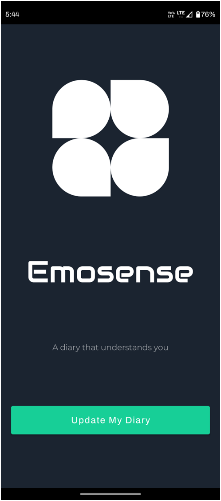
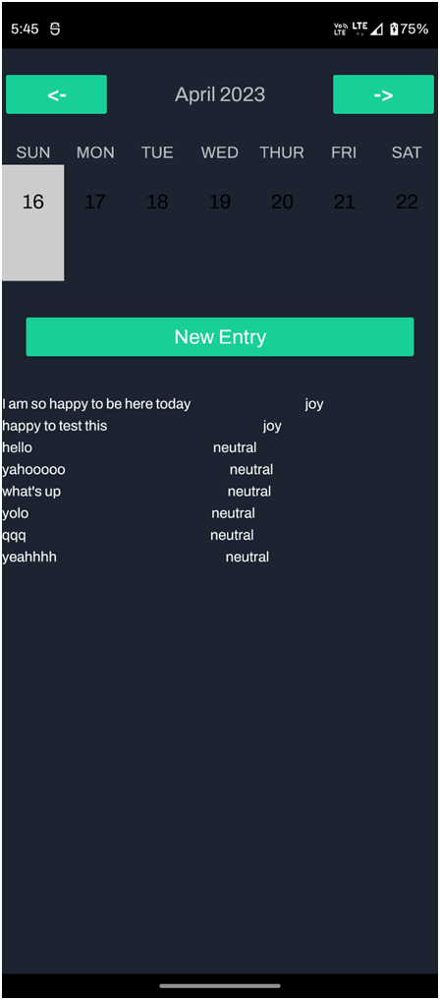
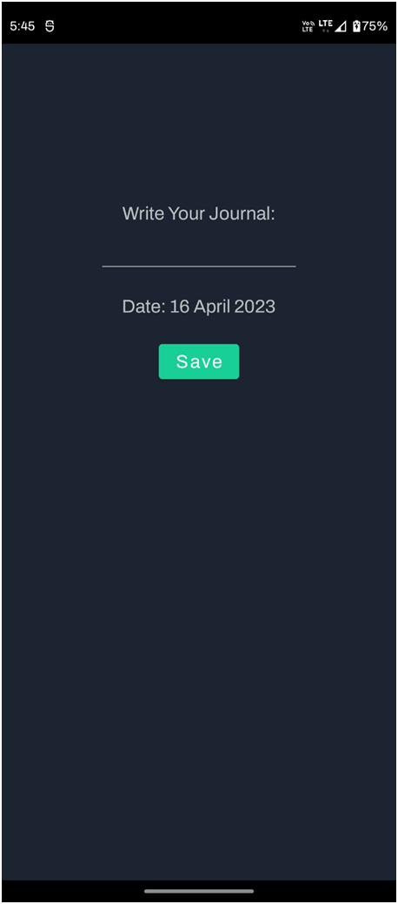

# Emosense: A diary that understands you

## Project Overview

Emosense is a mobile application designed to enhance the journaling experience by leveraging emotion recognition technology. Users can input entries through text, and the backend processes them using the EmoRoberta model to identify predominant emotions. Entries are synced across devices, promoting consistency and accessibility.

## Key Features

* **Emotion Recognition:** Gain insights into your emotional state by analyzing journal entries with EmoRoberta, a powerful emotion labeling model.
* **Cloud Sync:** Never lose your entries! Emosense synchronizes your journal across all your devices where you're logged in.
* **Entry Reminder Notifications:** Stay on track with your journaling habit by setting up personalized daily reminders.
* **Music Recommendation (Primitive):** Explore music that aligns with your emotions. EmoRoberta's emotion labels are currently mapped to genres, and Youtube Data API fetches three recommended tracks.

## Technical Stack

* **Android:** Kotlin, XML
* **Backend:** Django, Django REST Framework
* **Database:** SQLite database
* **EmoRoberta Model:** Emotion labeling model
* **Authentication:** JWT

## Screenshots

* Splash Screen Activity

* Sign In Activity

* Sign Up Activity

* Main Activity

* New Entry Activity

## License

This project is licensed under the GPL License (see `LICENSE` file).
